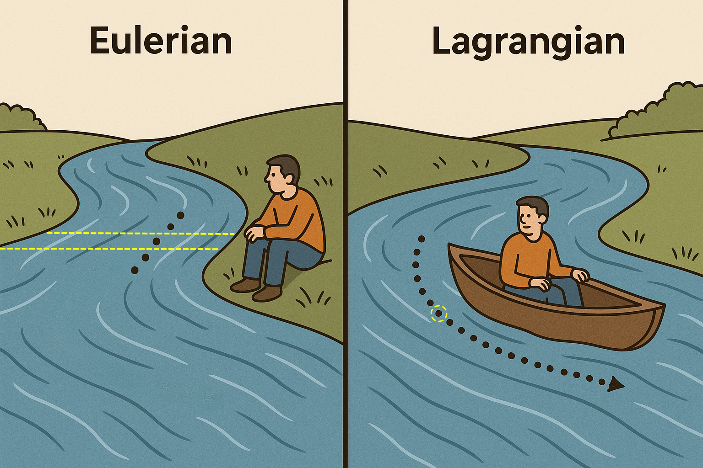

# Smoothed Particle Hydrodynamics <!-- omit in toc --> 

## Table of Contents <!-- omit in toc --> 

- [Introduction](#introduction)
- [Hydrodynamic Force](#hydrodynamic-force)
- [The Kernel Function](#the-kernel-function)
  - [Interactive Widget!](#interactive-widget)
- [Calculating Gradients](#calculating-gradients)
- [Equation of State](#equation-of-state)

## Introduction

Our goal is to determine the **hydrodynamic forces** that dictate how our astrophysical "fluid" evolves. This is the key that will allow us to simulate its evolution.

**Smoothed Particle Hydrodynamics** (SPH) is a technique to calculate hydrodynamic forces by following how individual "parcels" (like delivery boxes) evolve in the fluid. More precisely, SPH provides a technique to calculate the density, pressure, their gradients, and therefore the pressure force from a set of points "in" the fluid.

 **Figure 1.** Source: Unknown :(

SPH is called a *Lagrangian* approach to fluid dynamics, as opposed to a *Eulerian* approach where quantities of a fixed volume in space are evolved instead.

## Hydrodynamic Force
The hydrodynamic force on particle $i$ in SPH is given by:

$$
\begin{equation}
\vec{F}_i = -m_i \sum_j m_j \left( \frac{P_i}{\rho_i^2} + \frac{P_j}{\rho_j^2} \right) \nabla_i W_{ij}
\end{equation}
$$

where $P_i$ and $P_j$ are the pressures, $\rho_i$ and $\rho_j$ are the densities, $m_i$ and $m_j$ are the masses. I will explain what $W_{ij}$ is in the next section. The pressure is related to the density through what is known as the *equation of state*, which is chosen based on the fluid you'd like to simulate. 

The key point here is that **in order to calculate the hydrodynamic force, $F_i$, on each particle, we need a good estimate of the local density, $\rho_i$, at each particle.** 

## The Kernel Function
The *smoothed* part of Smoothed Particle Hydrodynamics comes from the fact that the force is determined by calculating several characterisics of the fluid, namely the density, by smoothly interpolating over the particles. 

For example, to determine the density at a point of interest, one sums the mass of neighboring particles and divides by the local volume. However, if one were to do this will all of the particles, they would not have a calculation of the local density at that point. Thus, the sum is weighted by a function of the particle separation, known as the kernel function, $W$. The image below illustrates this point. 

 **Figure 2.** Source: Vignjevic et al., 2021

Notice that beyond a particular radius, $2h$, from the point of interest, particles contribute nothing to the local density. 

In my code, I follow convention by using the *cubic spline kernel* function:

$$
\begin{equation}
W(r, h) = \frac{1}{\pi h^{3}} \begin{cases}
1 - \frac{3}{2}q^2 + \frac{3}{4}q^3 & \text{if } 0 \leq q \leq 1 \\
\frac{1}{4}(2 - q)^3 & \text{if } 1 < q \leq 2 \\
0 & \text{if } q > 2
\end{cases}
\end{equation}
$$

where $q = r/h$ is the dimensionless distance and $h$ is the smoothing length.

With this in mind, the formula to caclulate the local density for a particle is:

$$
\begin{equation}
\rho_i = \sum_j m_j W(|\vec{r}_i - \vec{r}_j|, h),
\end{equation}
$$
where $|\vec{r}_i - \vec{r}_j|$ is the distance between particles $i$ and $j$.

The choice of smoothing length, $h$, impacts the quality of the approximation. This parameter is either user defined, or in more serious codes, it is adaptive. 

### Interactive Widget!
***What would you say is the best choice for $h$ in the example below?***

...widget...

## Calculating Gradients

As your intuition may tell you, we are actually more interested in the *gradients* of these fields; the natural tendency is to move from areas of high pressure (density) to low pressure (density). Looking at the expression for the density in the last section reveals another advantage of SPH and our chosen kernel -- it's east to differentiate!

To get the gradient of density or pressure, we need the gradient of the kernel function, $W$.

$$
\begin{equation}
\nabla_i W_{ij} = \frac{dW}{dr}\bigg|_{r=|\vec{r}_{ij}|} \hat{\vec{r}}_{ij},
\end{equation}
$$

which basically says that you take the derivative of $W$ with respect to $r$, which is spherically symmetric. Then you multiply it by the unit vector along the direction separating particles $i$ and $j$ to give the direction of the gradient. 

Finding the derivative $dW/dr$ is as simple as differenting the Equation (2) with respect to $r$:

$$
\begin{equation}
\frac{dW}{dr} = \frac{\sigma}{h^{d+1}} \begin{cases}
-3q + \frac{9}{4}q^2 & \text{if } 0 \leq q \leq 1 \\
-\frac{3}{4}(2 - q)^2 & \text{if } 1 < q \leq 2 \\
0 & \text{if } q > 2
\end{cases}
\end{equation}
$$

## Equation of State
To this point we have addressed how to calculate the local density, the kernal function, and gradients. Looking back at Equation 1, all we are missing now is how to calculate the pressure. 

In my code, I only consider **barotropic fluids**, meaning that pressure is a function of density only. The form of the function relating pressure to density varies depending on the fluid you wish to simulate. I implement a simplified form of the Tait equation:

$$
\begin{equation}
P_i = \frac{\rho_i c_s^2}{\gamma},
\end{equation}
$$
where $c_s$ is the sound speed and $\gamma$ is the stiffness parameter. The stiffness parameter is $5/3$ for adiabatic gas and $7$ for water.